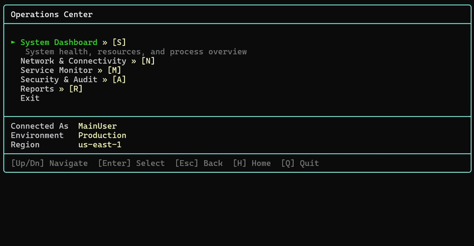
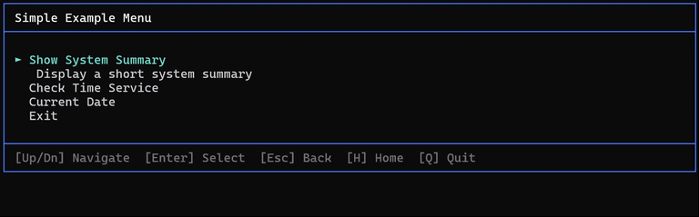

# **PSYamlTUI**

> YAML-powered terminal menus for PowerShell. Define once, navigate anywhere.

| Build | Gallery | Downloads | License | PowerShell |
|-------|---------|-----------|---------|------------|
| [![build][]][build-site] | [![psgallery][]][ps-site] | [![downloads][]][ps-site] | [![license][]][license-link] | [![ps-version][]][ps-site] |

[build]:https://github.com/yourusername/PSYamlTUI/actions/workflows/publish.yml/badge.svg
[build-site]:https://github.com/yourusername/PSYamlTUI/actions/workflows/publish.yml
[psgallery]:https://img.shields.io/powershellgallery/v/PSYamlTUI.svg
[ps-site]:https://www.powershellgallery.com/packages/PSYamlTUI
[downloads]:https://img.shields.io/powershellgallery/dt/PSYamlTUI.svg?color=blue
[license]:https://img.shields.io/github/license/yourusername/PSYamlTUI.svg
[license-link]:https://github.com/yourusername/PSYamlTUI/blob/main/LICENSE
[ps-version]:https://img.shields.io/badge/powershell-5.1%2B-blue.svg

---



> A demo GIF will live here. Imagine something beautiful.

---

- [Features](#features)
- [Installation](#installation)
- [Quick start](#quick-start)
- [Parameter reference](#parameter-reference)
- [YAML schema](#yaml-schema)
- [Guides](#guides)
- [Navigation](#navigation)
- [Themes](#themes)
- [Contributing](#contributing)
- [License](#license)
- [Author](#author)

---

## Features

- **YAML-driven menus** → define your menu once in a YAML file and launch it anywhere with a single command
- **Recursive submenus** → nest menus as deep as you need via inline `children` or external `import` files
- **Three rendering tiers** → ANSI+Unicode, Write-Host+Unicode, and Write-Host+ASCII means it works everywhere from Windows Terminal to legacy consoles without any config
- **Automatic terminal detection** → PSYamlTUI figures out what your terminal supports so you don't have to
- **Five border styles** → Single, Double, Rounded, Heavy, and ASCII to match your vibe
- **Fully customizable themes** → pass a theme hashtable or point `-ThemePath` at a YAML or JSON theme file
- **Remappable key bindings** → remap any key to make navigation feel exactly right for you
- **Token substitution** → use `{{key}}` placeholders in your YAML and supply values from `vars.yaml`, `-VarsPath`, or `-Context`
- **Before hooks** → gate branch access or leaf execution with reusable PowerShell functions that return `$true`, `$false`, or throw
- **Status bar** → show session context like connected user, environment name, or anything else right inside the menu
- **Safe execution** → scripts and functions are called via the `&` operator with path validation, root-jail enforcement, and injection prevention; `Invoke-Expression` is never used
- **PowerShell 5.1 and 7+** → works on both Windows PowerShell and PowerShell Core

---

## Installation

PowerShell 5.1 or higher is required. No other dependencies needed → everything is bundled.
```powershell
# Install from PowerShell Gallery
Install-Module -Name PSYamlTUI -Scope CurrentUser

# Import
Import-Module PSYamlTUI

# Verify
Get-Command -Module PSYamlTUI
```

---

## Quick start

### Simple → just point it at a YAML file and go
```powershell
Start-Menu -Path .\menu.yaml
```

### Intermediate → add a status bar and a rounded border
```powershell
Start-Menu -Path .\menu.yaml -BorderStyle Rounded -StatusData @{
  'Connected As' = ([System.Security.Principal.WindowsIdentity]::GetCurrent().Name -split '\\')[-1]
    'Environment'  = 'Production'
}
```

### Advanced → vars, context, YAML theme file, and remapped keys
```powershell
Start-Menu -Path .\menu.yaml -VarsPath .\production.vars.yaml -Context @{ currentUser = $env:USERNAME } -ThemePath .\theme.yaml -BorderStyle Double -KeyBindings @{
    Up     = [System.ConsoleKey]::UpArrow
    Down   = [System.ConsoleKey]::DownArrow
    Select = [System.ConsoleKey]::RightArrow
    Back   = [System.ConsoleKey]::LeftArrow
    Quit   = 'X'
    Home   = 'H'
}
```

You can find ready-to-run examples in [`Docs/Examples/MenuLaunchers/`](Docs/Examples/MenuLaunchers/).

---

## Parameter reference

| Parameter | Type | Default | Description |
|-----------|------|---------|-------------|
| `-Path` | string | `.\menu.yaml` | Root menu YAML path |
| `-VarsPath` | string | auto `.\vars.yaml` | Vars YAML path (`vars:` map) |
| `-Context` | hashtable | none | Runtime token values (wins over vars) |
| `-BorderStyle` | string | `Single` | `Single`, `Double`, `Rounded`, `Heavy`, `ASCII` |
| `-KeyBindings` | hashtable | defaults | Key map for Up/Down/Select/Back/Quit/Home |
| `-Theme` | hashtable | defaults | Theme overrides as ConsoleColor values |
| `-ThemePath` | string | none | YAML/JSON theme file path |
| `-StatusData` | hashtable | none | Status bar key/value pairs |
| `-Timer` | switch | off | Shows elapsed execution time after leaf actions |

---

## Guides

- [Docs/menu-yaml-reference.md](Docs/menu-yaml-reference.md) → schema, tokens, imports, hooks, and examples
- [Docs/vars-vs-context.md](Docs/vars-vs-context.md) → when to use vars.yaml vs runtime context values
- [Docs/hook-function-best-practices.md](Docs/hook-function-best-practices.md) → how to write reliable hook functions
- [Docs/root-jail-security.md](Docs/root-jail-security.md) → how script path security and root-jail enforcement work
- [Docs/Examples/README.md](Docs/Examples/README.md) → runnable simple, intermediate, and advanced examples

---

## YAML schema

PSYamlTUI infers the node type from the keys present -- you never have to declare it explicitly.
```yaml
menu:
  title: "Main Menu"
  items:
    - label: "Reports"
      description: "Run system reports"
      children:
        - label: "System Info"
          call: "./scripts/Show-SystemInfo.ps1"
          confirm: true
        - label: "Process Report"
          call: "./scripts/Get-ProcessReport.ps1"
    - label: "Settings"
      import: "./menus/settings.yaml"
    - label: "Exit"
      exit: true
```

### Node types

| Keys present | Node type | Behavior |
|---|---|---|
| `exit: true` | EXIT | Cleanly quits the menu |
| `children` or `import` | BRANCH | Drills into a submenu |
| `call` with `.ps1` or path chars | SCRIPT | Executes a script via safe `&` call |
| `call` with no extension | FUNCTION | Calls a whitelisted PowerShell function |

### Valid node properties

| Key | Required | Notes |
|---|---|---|
| `label` | yes | Display text shown in the menu |
| `exit` | no | Set to `true` to signal a clean quit |
| `children` | no | Inline list of submenu items |
| `import` | no | Relative path to an external YAML submenu file |
| `call` | no | Script path or function name to execute |
| `params` | no | Hashtable of parameters splatted to `call` |
| `confirm` | no | If `true`, prompts Y/N before executing |
| `description` | no | Subtitle shown when the item is selected |
| `hotkey` | no | Single character shortcut, case-insensitive |
| `before` | no | Pre-execution hook, hook object, or ordered list of hooks |

---

## Navigation

All keys are remappable via the `-KeyBindings` parameter -- see the Quick Start section for an example.

| Key | Action |
|-----|--------|
| `Up` / `Down` | Navigate items |
| `Enter` / `Right Arrow` | Select / drill into submenu |
| `Left Arrow` / `Escape` | Go back one level |
| `Q` | Quit |
| `H` | Jump to home / root menu |
| `Home` / `End` | Jump to first / last item |
| `PageUp` / `PageDown` | Scroll long menus |

---

## Themes



PSYamlTUI always starts from its built-in default theme values. You can either pass a hashtable to `-Theme` or pass a YAML/JSON file to `-ThemePath`.

The runnable examples in [Docs/Examples/README.md](Docs/Examples/README.md) use external YAML theme files in:

- [Docs/Examples/Fixtures/themes/simple.theme.yaml](Docs/Examples/Fixtures/themes/simple.theme.yaml)
- [Docs/Examples/Fixtures/themes/intermediate.theme.yaml](Docs/Examples/Fixtures/themes/intermediate.theme.yaml)
- [Docs/Examples/Fixtures/themes/advanced.theme.yaml](Docs/Examples/Fixtures/themes/advanced.theme.yaml)

### Theme hashtable shape

Any key you omit falls back to the `Default` theme value, so partial overrides are totally fine.
```powershell
@{
    Border          = 'DarkCyan'   # box-drawing characters and frame
    Title           = 'White'      # menu title text
    Breadcrumb      = 'DarkGray'   # breadcrumb trail
    ItemDefault     = ''           # unselected items -- empty string uses terminal default
    ItemSelected    = 'Yellow'     # highlighted item
    ItemHotkey      = 'DarkGray'   # hotkey character
    ItemDescription = 'DarkGray'   # subtitle shown under selected item
    StatusLabel     = 'DarkGray'   # status bar key names
    StatusValue     = 'Cyan'       # status bar values
    FooterText      = 'DarkGray'   # footer separator and label text
}
```

All values are `[System.ConsoleColor]` names.

Simplest YAML theme file:

```yaml
Border: "DarkGreen"
Title: "White"
Breadcrumb: "Gray"
ItemDefault: ""
ItemSelected: "Yellow"
ItemHotkey: "Cyan"
ItemDescription: "Gray"
StatusLabel: "DarkGray"
StatusValue: "Cyan"
FooterText: "Gray"
```

Also supported:

```yaml
theme:
  Border: "DarkGreen"
  Title: "White"
```

Hashtable example:

```powershell
$theme = @{
    Border       = 'DarkCyan'
    Title        = 'White'
    ItemSelected = 'Yellow'
}

Start-Menu -Path .\menu.yaml -Theme $theme
```

Theme file example:

```powershell
Start-Menu -Path .\menu.yaml -ThemePath .\theme.yaml
```

---

## Contributing

Contributions are very welcome! If you have an idea or found a bug, please open an issue first so we can talk through it before you start building. Pull requests are appreciated.

See [CONTRIBUTING.md](CONTRIBUTING.md) for more details.

---

## License

This project is licensed under the [MIT License](LICENSE).

---

## Author

Built by [Dan Metzler](https://github.com/yourusername).
